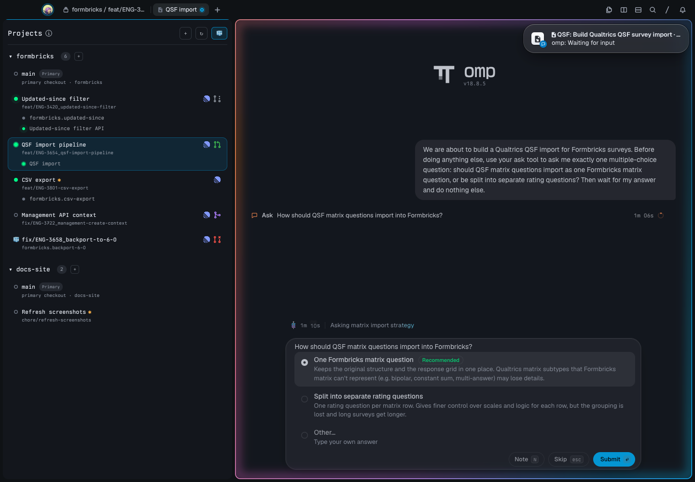
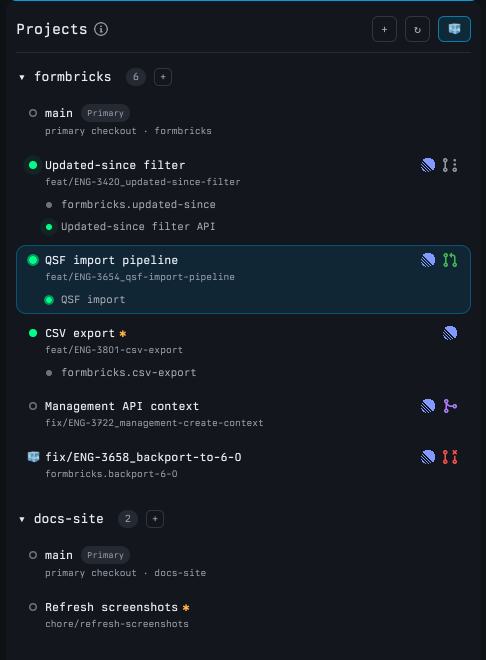
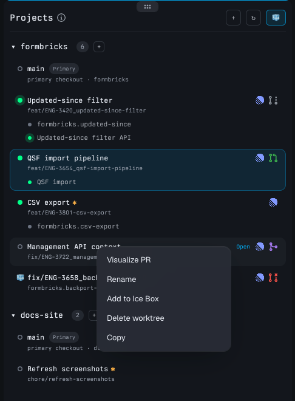
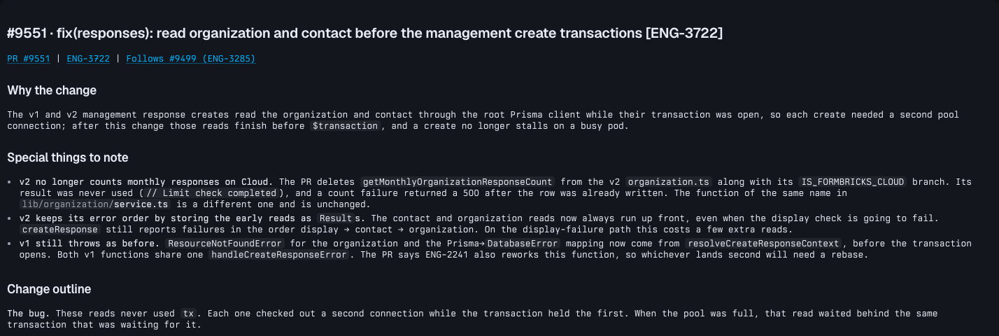
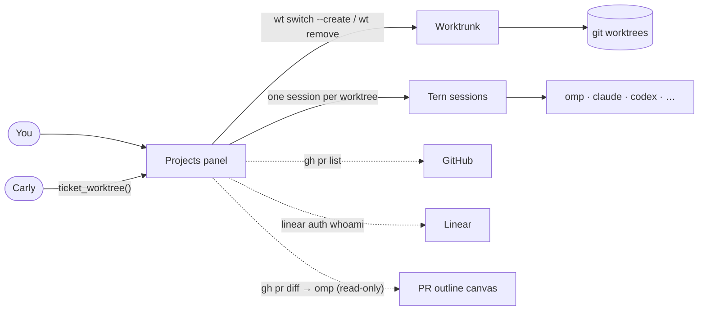

<div align="center">

# Overseer

**Mission control for parallel agent work.**

One panel for every branch you have in flight: its worktree, its agents, its pull request and its ticket.<br>
Click a row and you're in that branch's own workspace.



</div>

---

Running five agents on five branches means five checkouts, a pile of terminals, and losing track of which agent is stuck waiting for you. Overseer is a [Tern](https://docs.stencil.so/tern/) plugin that fixes that:

- **Every worktree gets its own Tern session.** Its tabs, shells and agents live there. Switching branches is one click, and nothing bleeds between them.
- **You can see what every agent is doing.** A pulsing dot means an agent is working; a blue dot means one is waiting for you.
- **PRs and tickets sit on the row.** GitHub PR state (draft, open, merged, closed) and the Linear ticket, both one click away.
- **Worktrees come and go safely.** Creation and deletion run through [Worktrunk](https://worktrunk.dev) in the background, with your hooks and approvals intact.
- **Agents can start work for you.** Tell Tern's assistant *"Create an overseer worktree for ENG-123"* and you get a branch, a session and an [omp](https://omp.sh) agent already reading the ticket.
- **PRs can be understood at a glance.** **Visualize PR** turns a pull request into a diagram-first outline, without touching GitHub.

## The panel

Each project is a local Git repository. Under it, every worktree is a row, and under each row are its open tabs. Click a tab to jump straight to it. Hover a row for its branch, path, line counts, ahead/behind and PR.

<table>
<tr>
<td width="50%"></td>
<td width="50%">

| You see | It means |
|---|---|
| ● green | A session is open |
| ● green, pulsing | An agent is working |
| ● blue, haloed | An agent is waiting for your answer |
| ○ hollow | No session yet; click to open one |
| **✱** amber | Uncommitted changes |
| **conflicts** | A merge or rebase is stuck |
| Linear logo | The branch names a ticket (`feat/ENG-123-…`) |
| PR icon | Draft, open, merged or closed PR |
| 🧊 | Parked in the Ice Box |

</td>
</tr>
</table>

## Install

You need macOS and:

| | Required for | |
|---|---|---|
| [Tern](https://docs.stencil.so/tern/) desktop | everything | tested with 0.6.2 |
| [Worktrunk](https://worktrunk.dev) (`wt`), Git, Bash | everything | tested with wt 0.40.0 |
| [GitHub CLI](https://cli.github.com) (`gh`), signed in | PR badges, Visualize PR | optional |
| [Linear CLI](https://github.com/schpet/linear-cli) (`linear`), signed in | ticket links | optional |
| [omp](https://omp.sh) | ticket agents, Visualize PR | optional |

```sh
git clone https://github.com/mmnavarr/overseer.git
cd overseer
/Applications/Tern.app/Contents/MacOS/tern plugin link "$PWD"
```

Linking reloads the plugin whenever the source changes. Use `tern plugin install "$PWD"` instead if you'd rather have a frozen copy.

## Use it

1. **Open Projects:** <kbd>⌘</kbd><kbd>⌥</kbd><kbd>⇧</kbd><kbd>P</kbd>, or **Open Projects** in the command palette.
2. **Add a repo:** **+** in the header opens the folder picker.
3. **Open a worktree:** click its row. Its session opens with the panel docked on the left.
4. **New worktree:** **+** next to a project. Type a branch name (and, if you like, a friendly display name). Setup runs in a background **Create** tab, and a notification tells you when it's ready.
5. **Everything else is a right-click away:**



- **Visualize PR** for a reviewer's outline of the branch's pull request
- **Rename** changes the row's label (the branch stays as it is)
- **Add to Ice Box** parks a worktree at the bottom; 🧊 in the header hides or shows parked ones
- **Close session** stops its programs and closes its tabs (the files stay)
- **Delete worktree** runs `wt remove`. It refuses if there are uncommitted changes and always keeps the branch.
- On a project: **Change base branch** and **Set Linear workspace**

### Start work from a ticket

Ask Tern's assistant, Carly:

> Create an overseer worktree for ENG-123

Overseer creates `feature/ENG-123` from the project's base branch and opens its session. Then it starts omp with:

> *Please read ticket ENG-123 to understand your task and ask any questions you have before we start*

The project is the one you're in, or name it: *"…for ENG-123 in api"*. If the branch already exists, Carly tells you instead.

### Visualize a PR



Overseer fetches the PR's metadata and full diff from GitHub, then has omp write an outline following HumanLayer's [visual-pr](https://github.com/humanlayer/skills) skill: why the change exists, what to watch for, and Mermaid diagrams, file-tree diffs and pseudocode. The local checkout only adds surrounding context. It takes a minute or two, and unchanged PRs reopen instantly from a cache.

It's **read-only by construction**: omp runs with only read/grep/glob tools and no shell, so it can't push, comment or edit anything.

## How it works



- **Worktrunk owns the worktrees.** Overseer calls `wt` and never passes `--yes`, `--no-hooks` or force flags. Your hooks and approval prompts run in a visible tab.
- **Tern owns the sessions.** Overseer remembers which session belongs to which worktree and switches between them.
- **Everything else is a read.** PR badges, ticket links, agent status and change counts come from `gh`, `linear`, `git` and Tern's own agent state.

## Safety

- Creation never fetches, pulls, or checks out anything in your primary checkout.
- Deletion rechecks the repository, branch and cleanliness right before it runs. It never deletes a branch. The primary checkout can't be deleted.
- Ignored files are removed with a deleted worktree's directory, so copy out anything you need first.
- Branch names and paths are passed as arguments, never as shell text.

---

## For agents

This section is for coding agents (and humans) changing Overseer. It favors completeness over brevity.

### Runtime model

Overseer is a Tern plugin written in Luau. `plugin.toml` declares two entry points:

- `host.luau` runs in Tern's host and renders the `overseer.form` block, the native form used for New worktree, Rename, Change base branch and Set Linear workspace. `input.luau` is its Unicode-aware text editing.
- `window.luau` runs once per Tern window. It owns the Projects navigator (a canvas), event hooks, the background job tracker, the Carly export, and Visualize PR canvases.

Tern APIs are typed in the definitions Tern generates: `/Applications/Tern.app/Contents/MacOS/tern plugin types <dir>` writes `tern.d.luau`. Read it before using an API you haven't used here.

### The 50 ms rule (read this first)

Tern gives **every plugin callback 50 ms**. A single overrun disables that hook (`canvas_action`, `timer`, `process`, …) **until the plugin reloads**, and the only trace is a line in `~/Library/Logs/Tern/tern.log`. A disabled `canvas_action` makes every click in the panel answer `Nothing handles "open" here`.

Consequences, enforced throughout `window.luau`:

- **Never draw inline.** Call `redraw(cx)`. It queues one coalesced `draw` in its own `tern.timer(0)` callback.
- `draw` renders **only the current session's navigator**. Every worktree session has its own navigator, and the hidden ones catch up on the `focus` event when their session is shown. Drawing all of them made one click cost 40 ms with eight sessions.
- Split expensive sequences across callbacks. `ensureSession` creates the session in the click, then opens its navigator in a later timer callback. `separately(fn)` runs `fn` in its own callback with errors reported.
- Process results (`tern.process.run` callbacks) must stay small too. They update state and call `redraw`.

When debugging an overrun, add temporary `tern.log.warn(string.format("PROBE …=%.1f", tern.now() - t0))` timings, reproduce in an isolated window (below), and remove them afterwards.

### Files

| File | What lives there |
|---|---|
| `window.luau` | Project registry, model building (`model`), drawing (`draw`/`redraw`), session binding (`ensureSession`, `openWorktree`), forms swapped into the panel's slot, background jobs (`launchCreation`, `checkJobs`), ticket links (`ticketOf`, `ticketFor`), Linear workspace lookup, Visualize PR canvases, the Carly export, hooks and the 750 ms `tick`. |
| `worktrunk.luau` | Every external command: `wt list`, validation, the creation and removal command lines, `git` status, `gh pr list`/`gh pr view`/`gh pr diff`, `linear auth whoami`. Commands are argv arrays; `find_executable` checks Homebrew, `/usr/local/bin`, `~/.bun/bin` and `~/.local/bin`. |
| `visualize.luau` | Visualize PR: prompt, read-only omp invocation, output extraction, cache. |
| `view.luau` | Pure render: model → Tern UI node tree (rows, badges, tab rows, confirmations, menus). |
| `worktree-operation.sh` | The helper that runs `wt switch --create` / `wt remove` in a visible terminal and writes an atomic completion receipt. |
| `host.luau`, `input.luau` | The native form block and its text input. |
| `styles.css`, `icons.css` | Panel styles. `icons.css` is **generated** by `icons/generate-css.py` (plugin stylesheets can't load files, so icons are embedded as data URIs). |
| `skills/visual-pr/` | HumanLayer's visual-pr skill, vendored unchanged (MIT). |
| `tests/test_worktree_operation.py` | Real Git/Worktrunk tests for the helper. |

### State

Tern's plugin KV (`~/Library/Application Support/Tern/plugin-data/overseer/kv.json`), via `tern.kv`:

| Key | Shape | Notes |
|---|---|---|
| `projects` | `[{id, name, path, base, linear?}]` | `id` is the repository's shared Git directory, so linked checkouts dedupe. `linear` overrides the CLI workspace. |
| `worktree-names` | `{[projectId]: {[path]: name}}` | Display names. Removed when Overseer deletes the worktree. |
| `sessions` | `{[path]: {id, host, project}}` | Worktree → Tern session binding. |
| `icebox` | `{[projectId]: {[path]: true}}` | Parked worktrees. `show-icebox` is the header toggle. |
| `jobs` | `{[id]: {kind = "create" \| "remove", project, receipt, pane, …}}` | Running creations and deletions; creations also carry `branch`, `displayName?` and `agentPrompt?`. Persisted so a plugin reload doesn't lose them. |

Files under `tern.plugin.data`: `creation-<id>.status` and `removal-<id>.status` receipts written by the helper, and the `visual-pr/<project>-<pr>-<headsha>.md` outline cache.

In-memory only: the per-project `cache` (worktrees, PRs, loading/error flags), `rendered` signatures per navigator pane, the Linear default workspace, open outline canvases.

### Flows

**Refresh.** `refresh` runs `wt list --format=json` per project, then `refreshPullRequests` (one `gh pr list` per GitHub project, at most every 2 minutes, immediately after ↻ or a worktree set change). An open navigator refreshes every 15 s from `tick`.

**Create.** Form or Carly → `wt.validate` → `launchCreation` opens a background tab running `worktree-operation.sh` and records a job → `checkJobs` (on `tick`) reads the receipt → on success: toast, apply the display name by branch (`applyCreatedName`), and for ticket worktrees `startTicketAgent` opens the session and calls `cx.agents:start({command = "omp", prompt = …})`. Creation succeeded means `wt` exited 0, not that every hook succeeded.

**Delete.** Confirmation → `wt.validate_removal` (repository identity, branch, cleanliness) → removal job in a background tab → receipt → close the worktree's session only if the directory is gone, then drop its name, binding and Ice Box entry.

**Agent status.** `agentActivity` reads `cx.agents:list()`: `state == "waiting_input"` → waiting, `"working"` → working. For agent CLIs in plain terminals (`omp`, `pi`, `claude`, `codex`, `opencode`, `gemini`, `aider`, `amp`, `cursor-agent`, `crush`, `goose`) it uses the pane's `busy` flag. Waiting wins over working per session and tab.

**Ticket links.** `ticketOf` takes the first uppercase `ABC-123` in the branch (`%f[%w](%u[%u%d]*%-%d+)%f[%W]`), so `chore/stage-1` doesn't count. The workspace is `project.linear`, else the slug from `linear auth whoami` (looked up once; ↻ retries a failure). URL: `https://linear.app/<workspace>/issue/<id>`.

**Visualize PR.** `wt.pull_request_meta` (`gh pr view --json …`) and `wt.pull_request_diff` (`gh pr diff > file`) write the PR into a temp dir under plugin data. Then `omp -p --no-session --no-extensions --no-skills --no-title --tools=read,grep,glob "<prompt>"` runs in the worktree with a 10-minute timeout. Its stdout from the first Markdown heading becomes the canvas. The read-only guarantee is the tool allow-list. Keep it that way: never add shell, edit or write tools, and never let it call `gh`.

**Carly.** `tern.carly.export("ticket_worktree", …)` validates the id, resolves the project (argument by name or path, else the current session's project), validates the branch and starts creation. It replies once creation *starts* (setup can outlast Carly's 120 s limit). `tern.carly.context` tells Carly the registered project names.

### Developing

Run the helper's tests (they use temporary repos, config and approvals):

```sh
python3 -B tests/test_worktree_operation.py -v
bash -n worktree-operation.sh
```

Smoke-test UI changes in an **isolated Tern window** so your real sessions are untouched:

```sh
D=$(mktemp -d); mkdir -p "$D/config"
TERN_CONFIG_DIR="$D/config" tern plugin link "$PWD"
TERN_CONFIG_DIR="$D/config" TERN_DAEMON_SOCKET="$D/daemon.sock" \
  /Applications/Tern.app/Contents/MacOS/tern --control "$D/desktop.sock"
```

Drive it with `tern ctl --control "$D/desktop.sock" …`:

- `ready`, `palette Projects`, `key Enter`, `click X Y [right]`, `shot NAME` (screenshots land in `target/shots/tern/live/`)
- `tree "[data-role=overseer\.worktreeRow]"` returns node rects and text
- `a11y` returns menu items and their bounds
- `carly lua "…"` runs Lua with a window `cx`, and `state` shows the result under `.carly.last_tool`

Seed projects by writing `$D/config/plugin-data/overseer/kv.json` before launch.

Other conventions:

- Editing any file in a linked plugin reloads it in every running Tern, which re-enables disabled hooks.
- After changing an icon, run `python3 icons/generate-css.py`.
- Bump `version` in `plugin.toml` for user-visible changes.
- Keep external commands in `worktrunk.luau` as argv arrays. Shell is only used where a redirect is needed, with arguments as `$0…$n`.

### Known limitations

- macOS only (folder picker, paths, Tern desktop).
- Visualize PR fails on PRs whose diff exceeds GitHub's 20,000-line API limit (`gh pr diff` returns HTTP 406). The tab shows the error.
- omp 18.8.5 reports its ask prompt as `working` rather than `waiting_input`, so an omp agent waiting on a question pulses instead of turning blue.
- If the timer hook is ever disabled, the panel stops redrawing until the plugin reloads (clicks still work).
- A plugin reload during a Visualize PR run, including the one Tern does when you edit a file in a linked plugin, ends the run and leaves its tab on the waiting message. Run it again.
- Tern 0.6.2 currently shows Mermaid blocks in canvases as source rather than diagrams (seen in both themes), so outline diagrams appear as code until Tern renders them again.
- Multiple Tern windows work but haven't been exhaustively tested together.

---

## Credits

- Pull request and info icons: [Primer Octicons](https://primer.style/octicons/) (MIT, `icons/LICENSE`).
- Visualize PR follows [humanlayer/skills](https://github.com/humanlayer/skills)' visual-pr skill, vendored at `ca7c8088db69` (MIT, `skills/visual-pr/LICENSE`).
- The Linear logo is a trademark of Linear Orbit, Inc., used to link to Linear tickets.
- Built on [Tern](https://docs.stencil.so/tern/), [Worktrunk](https://worktrunk.dev) and [omp](https://omp.sh).

## License

[MIT](LICENSE)
